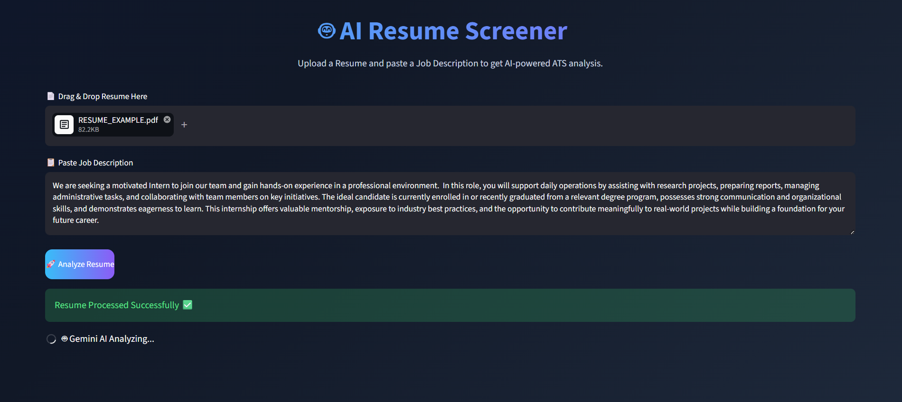

# 🤖 AI Resume Screener

An AI-powered ATS (Applicant Tracking System) resume analyzer built with Python, Streamlit, and Google Gemini 2.5 Flash.

Upload a PDF resume, paste a job description, and get an instant AI-generated match score with tailored feedback.



---

## ✨ Features

- 📄 PDF resume parsing with `pdfplumber`
- 🤖 Real AI match score (0–100) powered by Google Gemini 2.5 Flash
- 🎯 Matched & missing skills detection
- 💡 Tailored improvement suggestions specific to the job description
- 📊 Resume statistics (pages, words, characters)
- 🔒 Secure API key handling via Streamlit secrets

---

## 🛠 Tech Stack

- **Frontend / UI** — Streamlit
- **PDF Parsing** — pdfplumber
- **AI / LLM** — Google Gemini 2.5 Flash API
- **Language** — Python 3.10+

---

## 🚀 Run Locally

**1. Clone the repo**
```bash
git clone https://github.com/shloksrvs-29/ai-resume-screener.git
cd ai-resume-screener
```

**2. Install dependencies**
```bash
pip install -r requirements.txt
```

**3. Add your Gemini API key**

Create a file at `.streamlit/secrets.toml`:
```toml
GEMINI_API_KEY = "your-gemini-api-key-here"
```

Get a free API key at: https://aistudio.google.com

**4. Run the app**
```bash
streamlit run app.py
```

---

## ☁️ Deploy on Streamlit Cloud

1. Push this repo to GitHub
2. Go to [share.streamlit.io](https://share.streamlit.io)
3. Connect your GitHub account
4. Select this repo and `app.py` as the entry point
5. Go to **Settings → Secrets** and add:
```toml
GEMINI_API_KEY = "your-gemini-api-key-here"
```
6. Click **Deploy** — your app will be live at `https://your-app.streamlit.app`

---

## 📁 Project Structure

```
ai-resume-screener/
├── app.py                  # Main Streamlit app
├── requirements.txt        # Python dependencies
├── .gitignore              # Excludes secrets and cache
├── README.md               # This file
└── screenshot.png          # App screenshot (add manually)
```

---

## ⚠️ Important

- Never commit `.streamlit/secrets.toml` — it contains your API key
- The `.gitignore` already excludes it, but double-check before pushing

---

## 👤 Author

**Shlok Srivastava**  
B.Tech Student — PSIT Kanpur (2024–2028)  
[LinkedIn](https://www.linkedin.com/in/shlok-srivastava-1b005b316/) • [GitHub](https://github.com/shloksrvs-29)
